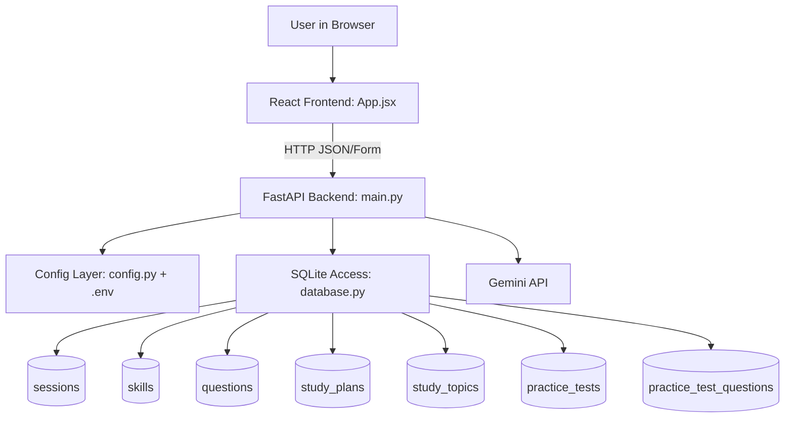
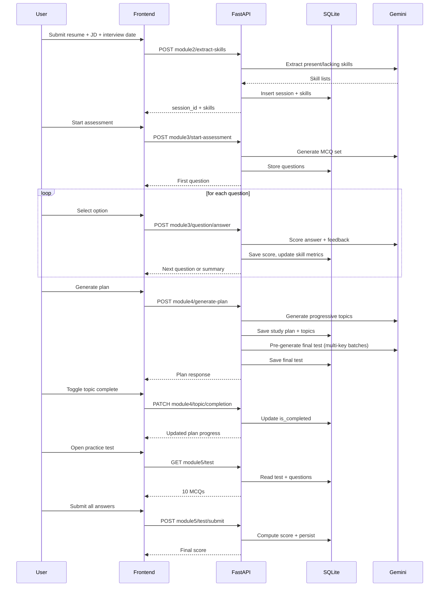

# SkillBridge Architecture and Logic

This document explains the runtime architecture, data flow, and scoring logic used in the project.

## 1. High-Level Architecture

## 2. Component Responsibilities

- Frontend (`frontend/src/App.jsx`)
  - Handles user workflow across modules.
  - Sends API requests via Axios.
  - Renders skills, assessment questions, plan topics, completion tracking, and final test.

- Backend API (`backend/main.py`)
  - Validates inputs and orchestrates each module.
  - Calls Gemini for extraction, question generation, study topics, and final test batches.
  - Normalizes AI output to strict schema constraints.
  - Persists and retrieves all session state in SQLite.

- Database layer (`backend/database.py`)
  - Creates/updates tables at startup.
  - Uses SQLite WAL mode and foreign keys.

- Config (`backend/config.py`)
  - Loads environment variables and app constants.
  - Supports three Gemini keys for workload separation.

## 3. End-to-End Sequence

## 4. Data Model Logic

- `sessions`
  - Root entity for one user run.
  - Stores source text and interview date.
  - Tracks workflow status.

- `skills`
  - Skills extracted from AI.
  - `category` is `present` or `lacking`.
  - `proficiency_score` and `priority_weight` are updated during module 3.

- `questions`
  - Assessment MCQs per present skill.
  - Stores options, correct index, selected index, score, feedback.

- `study_plans` + `study_topics`
  - One study plan per session.
  - Topics include subtopics, resources, estimated hours, day/focus order, completion flag.

- `practice_tests` + `practice_test_questions`
  - One final test per session.
  - Stores 10 mixed MCQs and submission score.

## 5. Scoring and Prioritization Logic

### 5.1 Assessment scoring (Module 3)

Per answered question:
- The selected option is validated against the 4-option set.
- AI scoring function returns:
  - `score` in range `[0.0, 1.0]`
  - feedback text

Skill metrics update:
- `avg_skill_score` = average of question scores for that skill in the session.
- `priority_weight` increases as score weakness increases.
- Weaker skills receive higher priority in study plan allocation.

Practical interpretation:
- Higher score -> lower priority weight.
- Lower score -> higher priority weight.

### 5.2 Study plan allocation (Module 4)

Main rules:
- If days remaining <= 7, plan is day-based.
- If days remaining > 7, plan is compressed to a capped focus-block count.
- Lacking skills are emphasized for foundations.
- Present skills are scheduled for gap closure and interview drills.
- Estimated hours are adjusted by weakness and category.

Normalization and quality guards:
- Topic names must be unique and specific.
- Subtopics must be concrete (non-generic).
- Repetitive topic/subtopic patterns are filtered.
- Resource links are deduplicated and supplemented.

Progress tracking:
- `progress_percent = completed_topics / total_topics * 100`.

### 5.3 Final test generation and scoring (Module 5)

Generation constraints:
- User must complete 100% of study topics.
- Target is exactly 10 MCQs.
- Multi-key generation strategy splits the request across available Gemini keys.
- Batches are merged and deduplicated by question text and topic.
- Diversity checks reject overly repetitive sets.
- If AI cannot satisfy requirements, fallback generation can be used as safety.

Submission scoring:
- User must answer all generated questions.
- Each selected option index must be 1..4.
- `correct_count` is exact-match count.
- `score_percent = (correct_count / total_questions) * 100`.

## 6. Failure Handling and Recovery

- Input validation errors return HTTP 400.
- Missing entities return HTTP 404.
- AI/quota/model failures return 503 where needed.
- SQLite busy errors return retry-style failure messages.
- Module 4 completion patch includes metadata fallback matching to reduce stale-id failures.

## 7. Reset and Restore Operational Notes

Runtime reset:
- Delete `backend/assessment.db` and optional WAL/SHM side files.
- Restart backend to recreate schema.

Code restore:
- Use git restore/clean for committed baseline recovery.
- Optional manual rollback can be done from `checkpoint_module3_stable_2026-04-26/`.

## 8. Key Design Decisions

- SQLite chosen for low setup and hackathon speed.
- AI output is always normalized before persistence.
- Session-centric schema keeps each user run isolated.
- Frontend is a single-page flow to minimize handoff friction.
- Module 5 pre-generation reduces wait time when user completes the plan.
